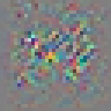

# Adversarial-Attacks-on-CapsNets

### Results  
| Avg. Pert Norm | CapsNet | ConvNet |
|----------------|---------|---------|
| Carlini-Wagner | 0.371   | 0.556   | 
| Boundary       | 0.989   | 1.757   |
| Deepfool       | 0.190   | 0.261   |

| Fooling Rate   | CapsNet | ConvNet |
|----------------|---------|---------|
| Carlini-Wagner | 94.8%   | 95.6%   |
| Boundary       | 100%    | 100%    |
| Deepfool       | 100%    | 94.5%   |

### Example images:  
Left original, middle adversarial example, right magnified perturbation  
Top Capsule Network, bottom Convolutional Network  

#### Carlini-Wagner:

  

  
  
  
#### Boundary-Attack:  

  

  
  
#### Deepfool:  

  

  
  
  
#### Universal Attack:  

  

